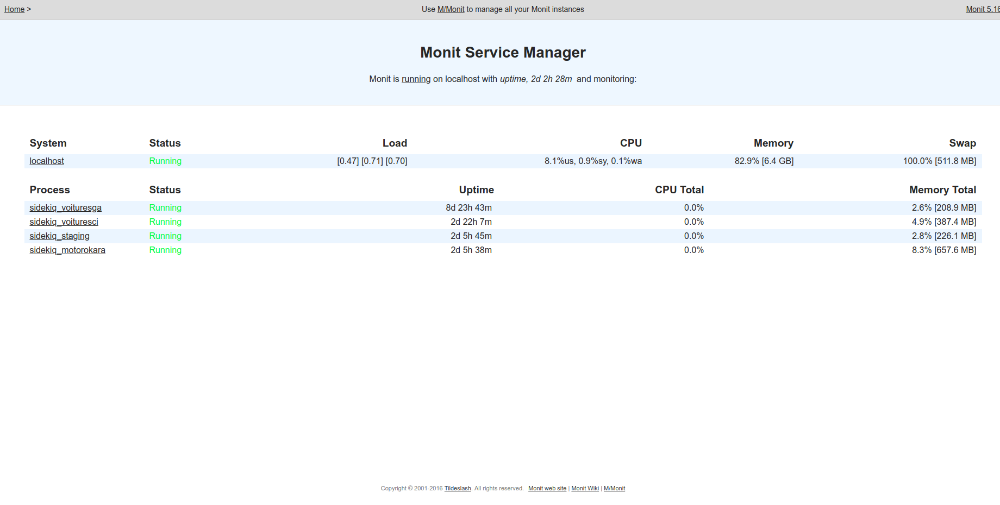
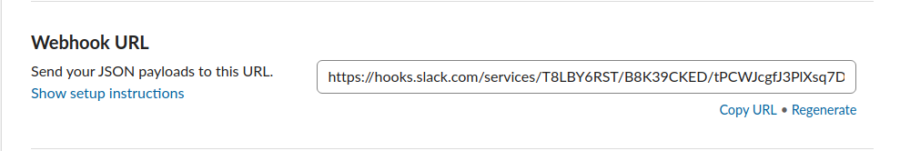
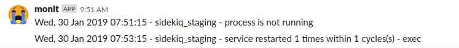

# Services Monitoring With Monit


## Monit
[Monit](https://mmonit.com/monit/) is a small Open Source utility for managing and monitoring Unix systems. [Monit](https://mmonit.com/monit/) conducts automatic maintenance and repair and can execute meaningful causal actions in error situations. E.g. [Monit](https://mmonit.com/monit/) can start a process if it does not run, restart a process if it does not respond and stop a process if it uses too much resources. You can use [Monit](https://mmonit.com/monit/) to monitor files, directories and filesystems for changes, such as timestamps changes, checksum changes or size changes.

### Installation

Monit is easiest to install through apt-get:

```
sudo apt-get install monit
```

Once monit downloads, you can add programs and processes to the configuration file:

```
sudo nano /etc/monit/monitrc
```

Monit can be started up with a command that then keeps it running in the background

```
monit
```

Typing ```monit status``` displays monit’s details:

```
System 'localhost'
  status                            Running
  monitoring status                 Monitored
  load average                      [1.21] [0.87] [0.81]
  cpu                               11.3%us 1.3%sy 0.2%wa
  memory usage                      6.4 GB [81.9%]
  swap usage                        511.9 MB [100.0%]
  data collected                    Fri, 01 Feb 2019 12:25:10
```
### Configure Monit

#### Web Service

Monit comes with it’s own web server running on port 2812. To configure the web interface, find and uncomment the section that begins with set httpd port 2812. Once the section is uncommented, write in your server’s IP or domain name as the address, allow anyone to connect, and then create a monit user and password

```
set httpd port 2812
    use address 12.34.56.789  # only accept connection from localhost
    allow 0.0.0.0/0.0.0.0        # allow localhost to connect to the server and
    allow admin:monit      # require user 'admin' with password 'monit'
```

After configuration is done, monit should reload and reread the configuration file, and the web interface will be available:

```
monit relaod
```

You will then be able to access the monit web interface by going to “example.com:2812”

Login with your user credentionals:



### Monit Check Process Script Example
This is an example of scrip for monitoring [sidekiq](https://github.com/mperham/sidekiq) with Monit

```
check process sidekiq_staging with pidfile /tmp/pids/sidekiq.pid
  start program = "bundle exec sidekiq -d -e production -c 3 -q staging -P /tmp/pids/sidekiq.pid"
  stop program = "bundle exec sidekiqctl stop /tmp/pids/sidekiq.pid 11'"
```

### Configuring Slack notifications

It's pretty cool to have all notifications in one place, so we shall create a channel for our monit alerts.

First, we need to configure slack for webhooks integration and get 
webhook URL




Let's create a script that uses curl to POST a message to a channel on Slack

```
URL="https://hooks.slack.com/services/T7W3HFJSO/B7XLPmQAZ/avi" # Slack Webhook URL

PAYLOAD="{
  \"attachments\": [
    {
      \"title\": \"$PROCESS was restarted\",
      \"color\": \"warning\",
      \"mrkdwn_in\": [\"text\"],
      \"fields\": [
        { \"title\": \"Date\", \"value\": \"$MONIT_DATE\", \"short\": true },
        { \"title\": \"Host\", \"value\": \"$MONIT_HOST\", \"short\": true }
      ]
    }
  ]
}"

curl -s -X POST --data-urlencode "payload=$PAYLOAD" $URL
```
Before running the script we should add some permissions

```
$ sudo chmod u+x /usr/local/bin/slack-webhook.sh
```

Next step is configure over process monitoring to use slack

```
check process sidekiq_staging with pidfile /tmp/pids/sidekiq.pid
  start program = "bundle exec sidekiq -d -e production -c 3 -q staging -P /tmp/pids/sidekiq.pid"
  stop program = "bundle exec sidekiqctl stop /tmp/pids/sidekiq.pid 11'"
  if 1 restart within 1 cycle then exec "/etc/monit/slack.sh"
  if does not exist then exec "/etc/monit/slack.sh"
  if does not exist then restart


```

Here is how our notifications look like:




## License
services-monitoring-with-monit is Copyright © 2015-2019 Codica. It is released under the [MIT License](https://opensource.org/licenses/MIT).

## About Codica

[](https://www.codica.com)

We love open source software! See [our other projects](https://github.com/codica2) or [hire us](https://www.codica.com/) to design, develop, and grow your product.
